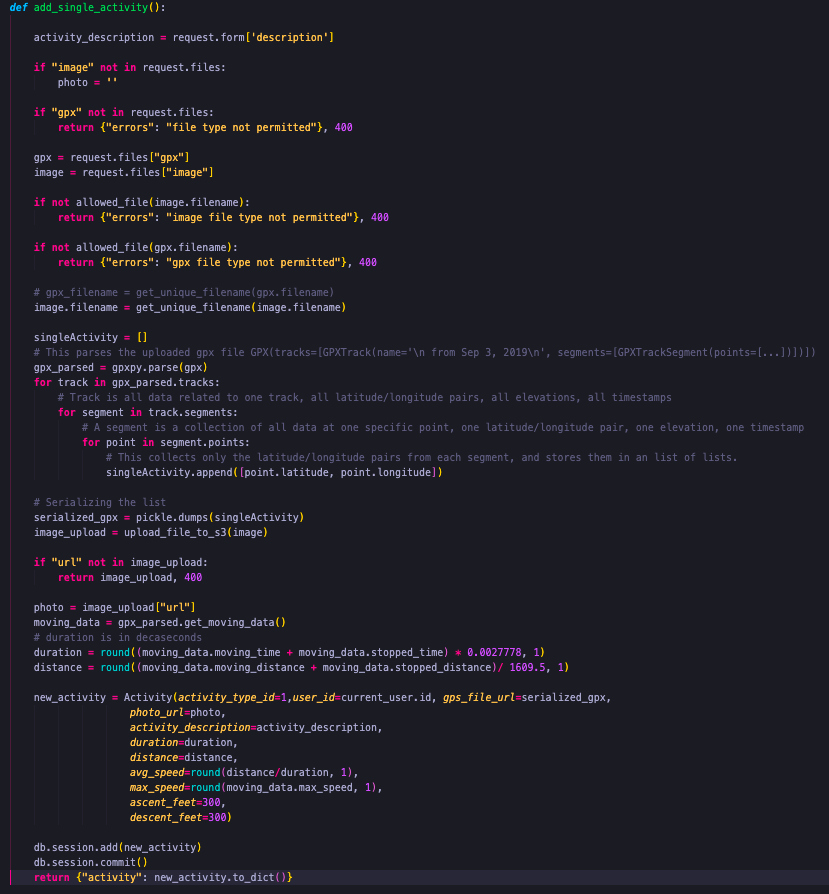
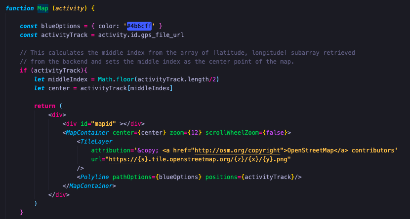

# Velocity Fitness

##  About Velocity 🚴‍♀️

Velocity is an activity tracker for endurance athletes with a social networking component. Users are able to upload a GPX file, an image of their activity, a description, and select type of activity (road biking, mountain biking, trail running, hiking, etc.). Users are able to follow other users they are interested in, and view all activities in a feed page. A user can like other athletes activities. 

## How it Works 👩‍💻

The mapping feature first parses the GPX file using GPXPY, and the latitude/longitude pairs are appended to a list. This list is stored in a table on the database as a bytes object. 

The frontend uses React Leaflet to plot the latitude, longitude point retrieved from the backend. 

This renders an activity map of the user's activity route. 

Additionally, the list containing the sublists of latitude/longitude pairs is stored in the Redux store, eliminating the need for repeated get requests between page navigation events. 