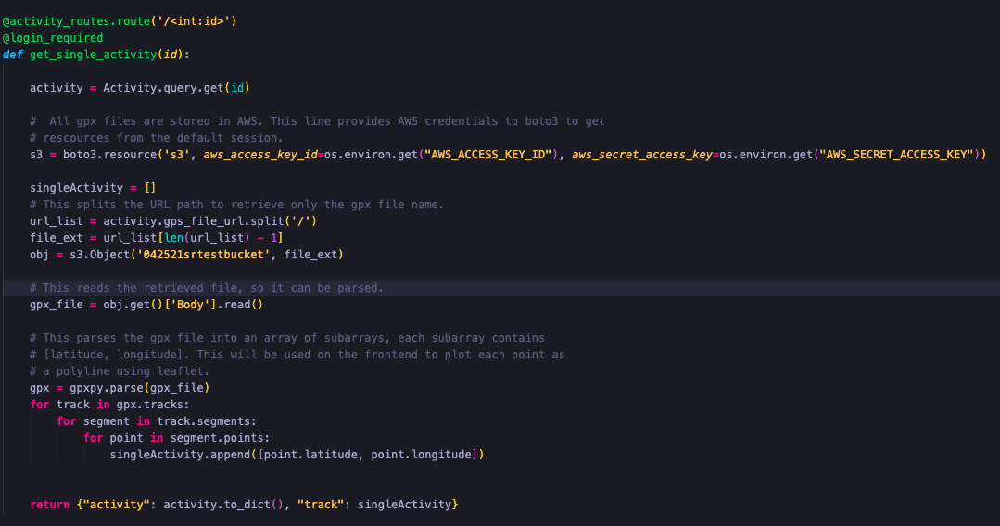
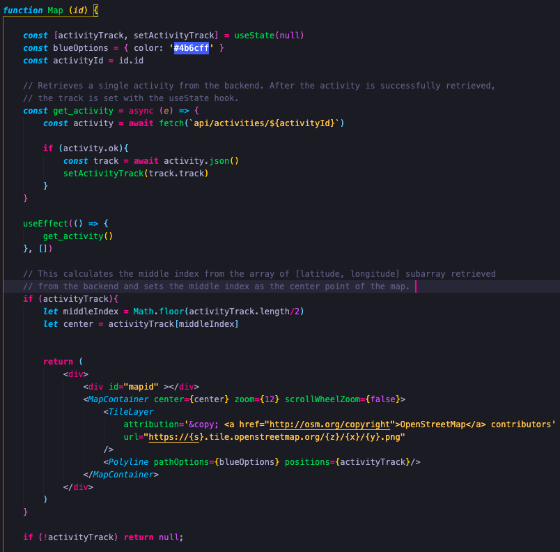

# Velocity Fitness

##  About Velocity 🚴‍♀️

Velocity is an activity tracker for endurance athletes with a social networking component. Users are able to upload a gpx file, an image of their activity, a description, and what type of activity (road biking, mountain biking, trail running, hiking, etc.). Users are able to follow other users they are interested in, and view all activities in a feed page. A user can like other athletes activities. 

## How it Works 👩‍💻

The mapping feature uses AWS to store the file, and gpxpy to parse the gpx file. 

The frontend uses React Leaflet to plot the latitude, longitude point retrieved from the backend. 

This renders an activity map of the user's activity route. 
